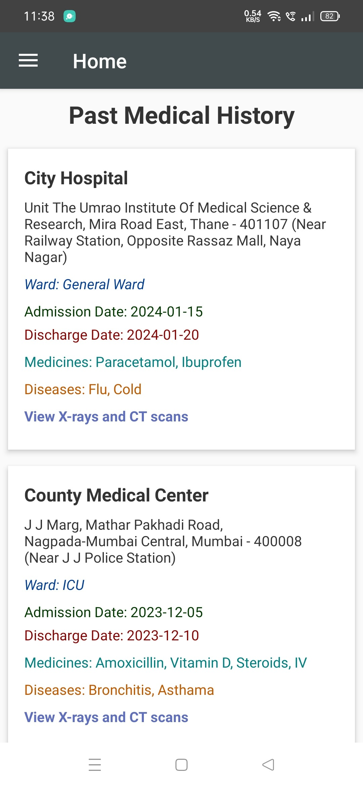

# Health Record Management System (Sehat Mitr) (on-going)

Sehat Mitr is a comprehensive health record management system designed to streamline healthcare data management and enhance patient care. The project includes both an Android application for end-users and a web-based admin panel for healthcare providers and administrators. The system enables users to access, manage, and share health records securely while providing advanced features like hospital location services and emergency assistance.

## Features
- User-Friendly Navigation: Intuitive navigation drawer with fragments for seamless app interaction.
- Hospital Locator: Helps users find nearby hospitals based on emergency needs, utilizing Google Maps API.
- Health Record Management: Displays health records in card-based layouts with details like admission/discharge dates, medicines, and diagnostics.
- Emergency Assistance: Users can select emergency cases and locate specialized hospitals within a defined radius.
- Secure Login and Logout System: Ensures user data security with a confirmation mechanism during logout.

## Mobile App

## Web Admin

## Technologies Used
- **Frontend:** Android (Java, XML), React (for web-based system)
- **Backend:** Node.js, Express.js
- **Database:** Firebase
- **Authentication:** Firebase Authentication

